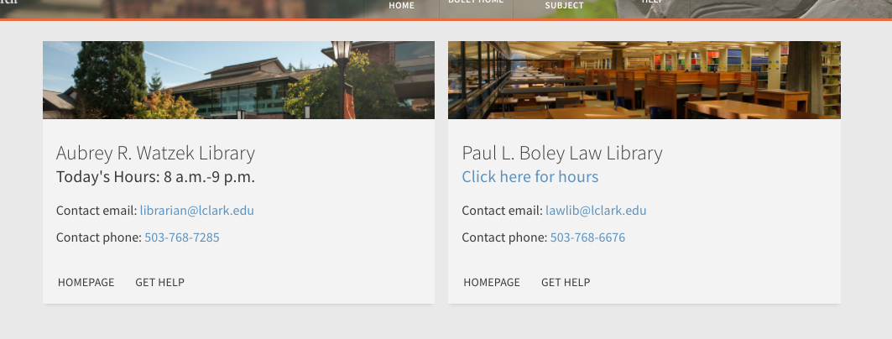

# primo-explore-library-hud

<!--  -->

## Features
A "heads-up display" (HUD) component can be added to the "new search" page (or elsewhere) to display basic information about one or more libraries. The libraries can be configured with an image, useful links, contact information, and open hours optionally fetched using a web service.

### Screenshot


## Install
1. Make sure you've installed and configured [primo-explore-devenv](https://github.com/ExLibrisGroup/primo-explore-devenv).
2. Navigate to your template/central package root directory. For example:
    ```
    cd primo-explore/custom/MY_VIEW_ID
    ```
3. If you do not already have a `package.json` file in this directory, create one:
    ```
    npm init -y
    ```
4. Install this package:
    ```
    npm install primo-explore-library-hud --save-dev
    ```

## Usage
Once this package is installed, add `libraryHUD` as a dependency for your custom module definition.

```js
var app = angular.module('viewCustom', ['libraryHUD'])
```

Note: If you're using the `--browserify` build option, you will need to first import the module with:

```javascript
import 'primo-explore-library-hud';
```

You can embed the HUD on the "new search" page by adding it to your package `home_en_US.html` file.

```html
<md-content>
    <library-hud layout-xs="column" layout="row" layout-align="center center"></library-hud>
</md-content>
```

You can configure the HUD by passing an array of library objects. All properties except `name` are optional.

| name         | type                  | usage                                                                                                                                                                                                                                       |
|--------------|-----------------------|---------------------------------------------------------------------------------------------------------------------------------------------------------------------------------------------------------------------------------------------|
| `name`       | string                | the name of the library                                                                                                                                                                                                                     |
| `email`      | string (email)        | contact email for the library                                                                                                                                                                                                               |
| `phone`      | string (phone) | contact phone for the library                                                                                                                                                                                                               |
| `img`        | string (url)          | URL to image of the library                                                                                                                                                                                                                 |
| `hours_link` | object                | has a `type` and `URL` param. if `type` is set to 'gcal', will attempt to fetch hours from a google calendar link in `url`. if `type` is 'page' or any other value, it will be used as a link with the text "click here for hours" instead. |
| `links`      | object[]              | an array of link objects that will be rendered as buttons on the card. each one has a `name` parameter for the button title and a `url` parameter for the destination of the button.                                                        |

The code below adds two example libraries.

```js
app.value('HUDLibraries', [{
    name: "My Awesome Library",
    email: "librarian@awesome.edu",
    phone: "555-555-5555",
    img: "https://library.awesome.edu/picture_of_library.jpg",
    hours_link: {
      "type": "gcal",
      "url": "https://library.awesome.edu/getHours.php"
    },
    links: [{
        "name": "Homepage",
        "url": "http://library.awesome.edu"
      },
      {
        "name": "Get Help",
        "url": "http://awesome.library.edu/help"
      }
    ]
  },
  {
    name: "Awesome Law School Library",
    email: "lawlib@awesome.edu",
    phone: "666-666-6666",
    img: "https://library.awesome.edu/picture_of_law_library.jpg",
    hours_link: {
      "type": "page",
      "url": "https://law.awesome.library.edu/hours/"
    },
    links: [{
        "name": "Homepage",
        "url": "http://law.awesome.library.edu"
      }
    ]
  }
])
```

<!-- ## Running tests
1. Clone the repo
2. Run `npm install`
3. Run `npm test` -->
